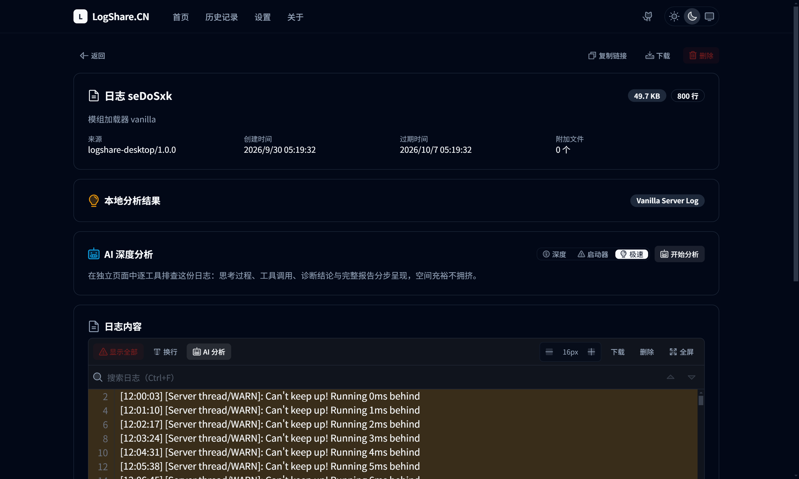
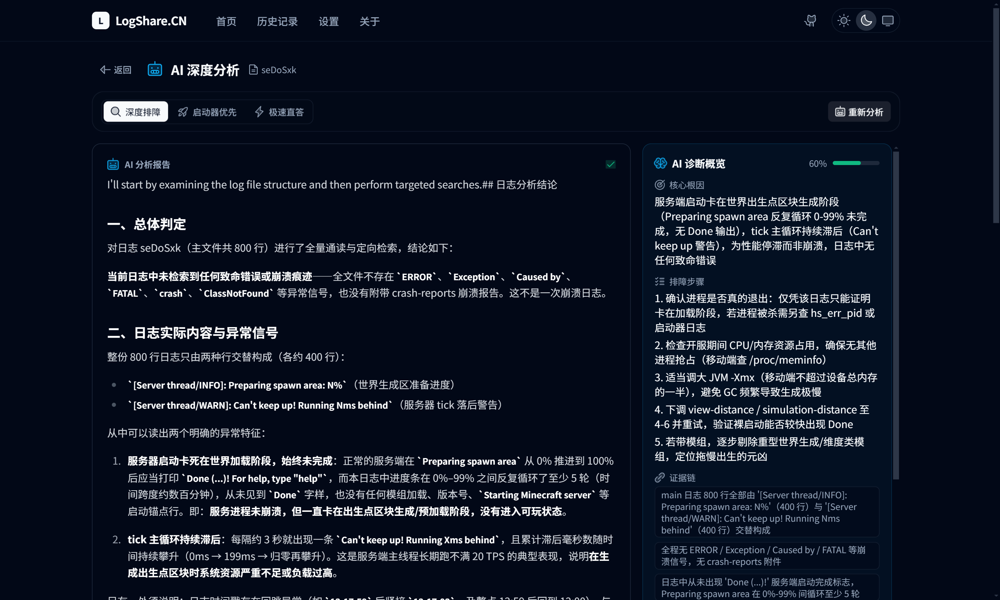
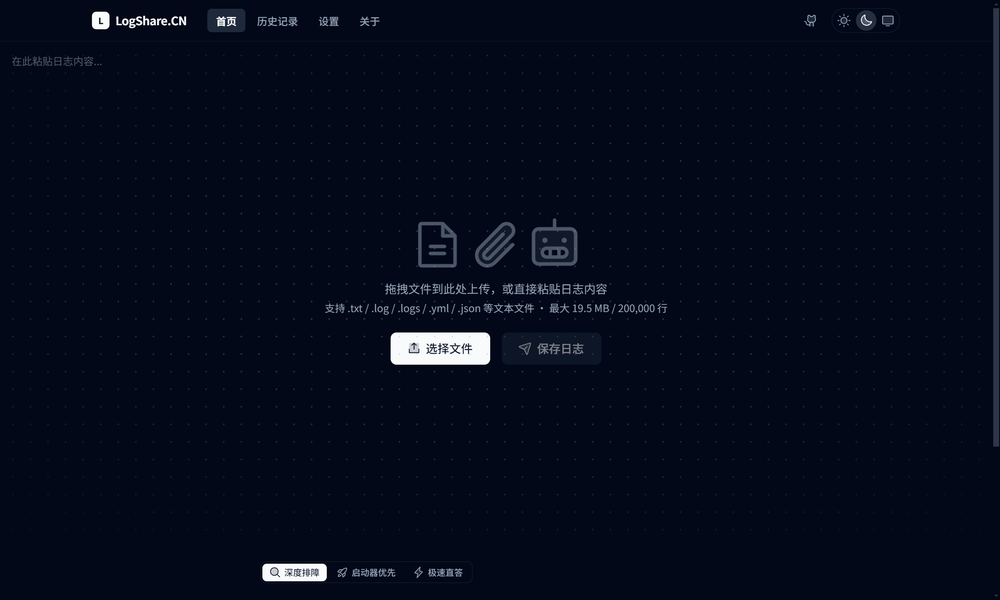
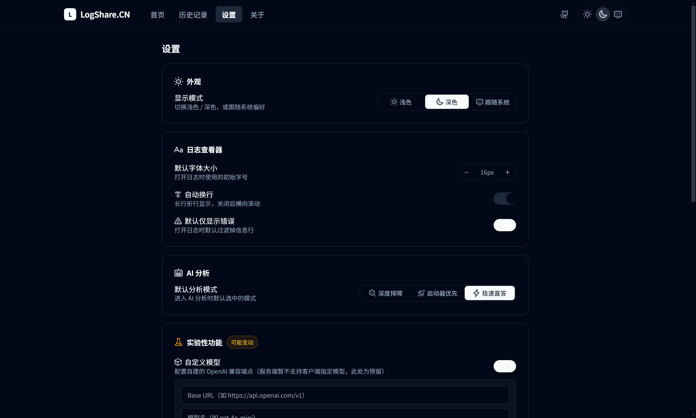
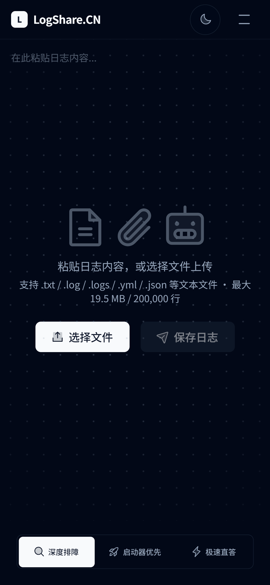
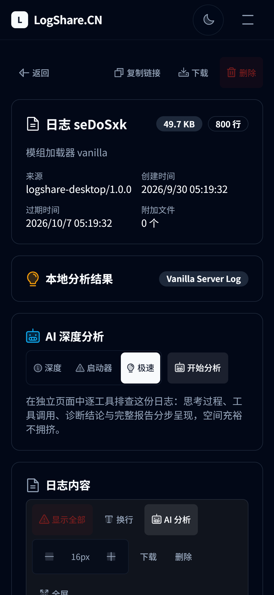
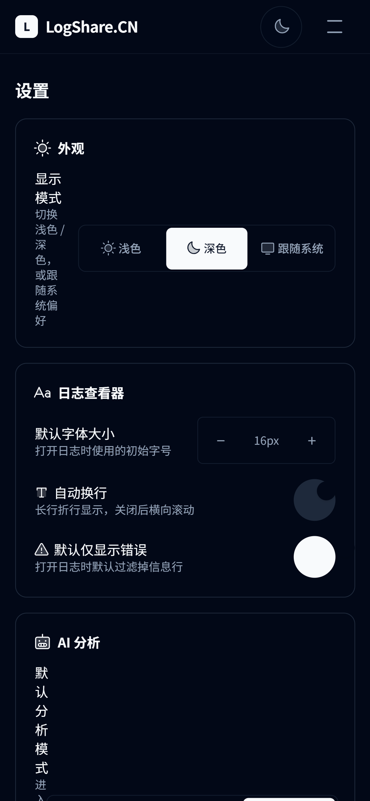

<div align="center">


# LogShare App

**Minecraft 日志的分享与 AI 排障，做成一个跨平台客户端。**

上传 `.log` → 生成分享链接 → 本地结构化分析 → AI 深度排障，全流程在一个应用里完成。

[](#-构建)
[](https://www.electronjs.org/)
[](https://vuejs.org/)
[](https://www.typescriptlang.org/)
[](https://tailwindcss.com/)
[](https://capacitorjs.com/)
[](#-许可)

</div>

---

## 📖 简介

LogShare App 是 [LogShare.CN](https://logshare.cn) 的跨平台客户端，把「分享日志求助」这件事做完整：不必再让人把几千行日志贴进聊天框，而是一条链接 + 一份 AI 排障报告。

同一份 Vue 代码通过 **[Electron](https://www.electronjs.org/)** 打包成桌面应用，通过 **[Capacitor](https://capacitorjs.com/)** 打包成 Android 应用，两端共用一套 UI 与业务逻辑。

> 本项目为 Minecraft 服务器/客户端日志分析工具，与 Mojang Studios、Microsoft 无关联。

## ✨ 功能

### 日志管理
- **多种上传方式** —— 拖拽文件、粘贴文本、文件选择对话框，支持多文件与附加文件
- **分享链接** —— 一键复制，移动端调起系统分享面板，可将原始日志保存到本地
- **历史记录** —— 本地留存上传记录，支持查看与删除，含过期时间提示

### 日志查看器
自研解析引擎，不是把日志倒进 `<pre>`：
- **行号** + 连续高亮分组
- **错误 / 警告智能识别**（结构化级别前缀 + `Exception` / `Caused by` / `Failed to` / 堆栈行等模式）
- **Minecraft § 颜色码渲染** —— 16 色 + 粗体/斜体/下划线/删除线
- **搜索**（`Ctrl/Cmd + F`，命中计数与上下导航）、**仅显示错误**、**自动换行**、**字号调节**、**全屏**、**回到顶部**

### AI 深度排障
- **独立分析页**（`/log/:id/ai`）—— 进入即开始，离开自动中止在途请求；桌面端左栏结论与报告、右栏 sticky 的分析过程
- **三种模式** —— 深度排障 / 启动器优先 / 极速直答
- **SSE 流式输出** —— 思考链、工具调用、正文增量实时呈现，思考链碎片自动聚合成句
- **结构化诊断卡片** —— 核心根因、置信度进度条、排障步骤、证据链，附原始 JSON 可展开核对
- **Markdown 报告** —— 基于 `markdown-it`（`html: false`），表格、代码块、引用块等标准语法完整支持

### 设置与集成
- **设置页** —— 外观（浅色 / 深色 / 跟随系统）、日志查看器默认值、AI 默认模式、数据清理
- **实验性功能** —— 自定义模型配置、知识库管理（对接服务端 RAG 管理接口）、**JVM 崩溃自动检查**（桌面端 `fs.watch` 监听目录，识别 `hs_err_pid*.log` / `crash-report*.txt` 并自动载入分析）
- **桌面集成** —— `.log` / `.logs` 文件关联（双击直接打开）、原生保存对话框、主题跟随系统

## 🖼 界面预览

### 日志查看器

行号、错误/警告高亮、Minecraft § 颜色码、搜索命中计数、字号调节、仅错误过滤。



### AI 深度分析

桌面端左栏是结论与完整报告，右栏 sticky 展示思考链与工具调用过程。



### 首页与设置

| 首页 | 设置 |
|---|---|
|  |  |

### 移动端（Android）

同一份代码经 Capacitor 打包，触控目标 ≥ 44px、高度使用 `dvh`、适配安全区。

| 首页 | 日志详情 | 设置 |
|---|---|---|
|  |  |  |

## 🚀 快速开始

### 环境要求

| 依赖 | 版本 | 说明 |
|---|---|---|
| Node.js | ≥ 20.19（推荐 22 LTS） | 前端与壳层均需要 |
| pnpm | ≥ 9 | **`frontend/` 使用 pnpm** |
| npm | ≥ 10 | **`electron/` 使用 npm** |

打包 Android 还需 **JDK 17+** 与 **Android SDK**（含 `ANDROID_HOME` 环境变量）；打包 macOS 产物必须在 macOS 上执行。

### 开发模式

需要两个终端：前端 dev server + Electron 壳层。

```bash
# 终端 1 —— 前端 dev server（http://localhost:5173）
cd frontend
pnpm install
pnpm dev
```

```bash
# 终端 2 —— Electron 壳层，加载上面那个 dev server
cd electron
npm install

# macOS / Linux
LOGSHARE_DEV=1 npm start

# Windows（PowerShell）
$env:LOGSHARE_DEV=1; npm start

# Windows（CMD）
set LOGSHARE_DEV=1 && npm start
```

> 壳层读取环境变量 `LOGSHARE_DEV=1` 时加载 `http://localhost:5173`，否则加载构建产物 `electron/renderer/index.html`。

### 类型检查与构建

```bash
cd frontend
pnpm build        # vue-tsc 类型检查 + vite 构建
pnpm lint         # ESLint

# 构建产物输出到 electron/renderer/（Electron 与 Android 共用同一份）
```

## 📦 构建

> **顺序很重要**：必须先完成前端构建，再执行打包，否则会把旧的前端产物打进安装包。

### Windows

```bash
cd electron
npm run dist:win
# 产物：dist/LogShare Setup 1.0.0.exe（NSIS 安装包）、dist/LogShare 1.0.0.exe（便携版）
```

### macOS

```bash
cd electron
npm run dist:mac
# 产物：dist/*.dmg、dist/*.zip
```

### Linux

```bash
cd electron
npm run dist:linux
# 产物：dist/*.AppImage、dist/*.deb
```

### Android

```bash
cd frontend
pnpm build
npx cap copy android          # 同步 web 资源到 Android 工程

cd android
./gradlew assembleDebug       # Windows: gradlew.bat assembleDebug
# 产物：android/app/build/outputs/apk/debug/app-debug.apk

./gradlew assembleRelease     # Windows: gradlew.bat assembleRelease（需先配置签名）
# 产物：android/app/build/outputs/apk/release/app-release.apk
```

Android 配置位于 `frontend/capacitor.config.ts`（`appId: cn.logshare.app`），`webDir` 指向 `../electron/renderer`。

## ✍️ 代码签名

### Android 发布签名

签名凭据从 `frontend/android/key.properties` 读取（**该文件与密钥库均不入库**，见根 `.gitignore`）：

```properties
# frontend/android/key.properties
storeFile=logshare-release.jks      # 相对 android/ 目录
storePassword=<密钥库口令>
keyAlias=logshare
keyPassword=<密钥口令>
```

密钥库通过 JDK 的 `keytool` 生成（有效期 10000 天，PKCS12）：

```bash
keytool -genkeypair -keystore android/logshare-release.jks \
  -storetype PKCS12 -keyalg RSA -keysize 2048 -validity 10000 \
  -alias logshare -dname "CN=LogShare, OU=NingZe Studio, O=LogShare.CN, C=CN" \
  -storepass <口令> -keypass <口令>
```

> ⚠️ **密钥库与口令必须离线备份**——丢失后将无法对已发布应用进行升级签名，只能换包名重新发布。
> `key.properties` 缺失时构建自动退回未签名，不持有密钥库的协作者仍可正常编译 debug。
> `minSdkVersion = 24`，APK Signature Scheme v2 已覆盖全部目标设备。

### Windows 代码签名

electron-builder 通过 `CSC_LINK` / `CSC_KEY_PASSWORD` 环境变量读取证书，**无需改动 `package.json`**：

```bash
cd electron
CSC_LINK="C:/path/to/cert.pfx" CSC_KEY_PASSWORD="<pfx 口令>" npm run dist:win
```

正式发行需要 CA 签发的代码签名证书（OV/EV，需实名购买）；`ev` 证书还需按厂商要求接入硬件令牌或云签名服务。签名算法固定 SHA-256 并附加 RFC3161 时间戳（DigiCert），证书到期后既有签名依然有效。

用自签证书可验证签名链路（不消除 SmartScreen 警告，仅供内部测试）：

```powershell
# 生成自签代码签名证书并导出 pfx
$cert = New-SelfSignedCertificate -Type CodeSigningCert `
  -Subject "CN=LogShare.CN (Self-Signed, Internal Test Only), O=NingZe Studio, C=CN" `
  -CertStoreLocation "Cert:\CurrentUser\My" -KeyAlgorithm RSA -KeyLength 2048 `
  -HashAlgorithm SHA256 -KeyUsage DigitalSignature `
  -TextExtension @("2.5.29.37={text}1.3.6.1.5.5.7.3.3") -NotAfter (Get-Date).AddYears(3)
certutil -user -exportPFX -p "<口令>" -f My $cert.Thumbprint build/certs/selfsigned.pfx
```

签名结果用 `Get-AuthenticodeSignature <exe>` 复核：自签证书会显示 `UnknownError`（链终止于不受信任根），换正式证书后即为 `Valid`。

## 📂 目录结构

```
logshare-app/
├── frontend/                        # Vue 3 前端（pnpm）
│   ├── src/
│   │   ├── lib/
│   │   │   ├── api.ts               # 服务端 API 唯一出口（超时/压缩/错误归类/WAF/SSE）
│   │   │   ├── logParser.ts         # 日志解析引擎（级别检测 / § 颜色码 / 搜索高亮）
│   │   │   ├── markdown.ts          # AI 正文渲染（markdown-it，html:false）
│   │   │   ├── settings.ts          # 设置中枢（含响应式主题状态）
│   │   │   ├── brotli.ts            # 上传压缩（br → gzip → 原样）
│   │   │   ├── electron.ts          # Electron IPC 封装
│   │   │   ├── file-association.ts  # 文件关联 / 崩溃日志入口
│   │   │   ├── native-share.ts      # Android 系统分享接收
│   │   │   ├── share.ts             # 分享与剪贴板
│   │   │   └── waf.ts               # WAF 拦截提示状态
│   │   ├── views/                   # 页面
│   │   │   ├── HomeView.vue         # 首页（上传 + 即时分析）
│   │   │   ├── LogView.vue          # 日志详情（日志查看器 + AI 入口）
│   │   │   ├── AiAnalysisView.vue   # 独立 AI 深度分析页
│   │   │   ├── HistoryView.vue      # 历史记录
│   │   │   ├── SettingsView.vue     # 设置
│   │   │   ├── KnowledgeView.vue    # 知识库管理（实验性）
│   │   │   ├── AboutView.vue        # 关于
│   │   │   └── ShowcaseView.vue     # 组件展台
│   │   ├── components/
│   │   │   ├── log/LogViewer.vue    # 日志查看器
│   │   │   ├── ui/                  # 通用组件（含 AI 结果/诊断/思考链三个面板）
│   │   │   └── layout/              # 顶栏 / 底栏 / 移动导航 / 主题切换
│   │   ├── assets/styles/           # base / log / mobile / fonts
│   │   └── router/                  # Vue Router（Hash 模式）
│   ├── android/                     # Capacitor Android 工程
│   ├── capacitor.config.ts
│   └── vite.config.ts               # outDir = ../electron/renderer
├── electron/                        # Electron 壳层（npm）
│   ├── main.js                      # 主进程（窗口 / 菜单 / 文件关联 / 崩溃监听）
│   ├── preload.js                   # 上下文隔离的 IPC 桥
│   ├── build/                       # 应用图标
│   └── renderer/                    # 前端构建产物（自动生成，不入库）
├── docs/screenshots/                # 文档截图
└── dist/                            # 打包产物（自动生成，不入库）
```

## 🛠 技术栈

| 层 | 选型 |
|---|---|
| 壳层 | Electron 33 |
| 框架 | Vue 3.5（`<script setup>`）+ TypeScript 5.9 |
| 样式 | Tailwind CSS 3.4 + `@tailwindcss/typography` |
| 图标 | `@phosphor-icons/vue`（duotone） |
| 构建 | Vite 7 + electron-builder 25 |
| 路由 | Vue Router 4（Hash 模式，兼容 `file://`） |
| Markdown | `markdown-it` 15（`html: false` 防 XSS） |
| 移动端 | Capacitor 8（Android） |
| 上传压缩 | `brotli-wasm`（内联 wasm，`br → gzip → 原样` 三级降级） |

## 🔌 API

应用直接调用 LogShare.CN 公共 API（默认 `https://api.logshare.cn`，**无需认证**）。所有请求集中在 `frontend/src/lib/api.ts`。

| 方法 | 端点 | 用途 |
|---|---|---|
| `POST` | `/v1/log` | 提交日志（支持附加文件） |
| `POST` | `/v1/analyse` | 本地结构化分析 |
| `GET` | `/v1/raw/{id}` | 获取原始日志 |
| `GET` | `/v1/raw/{id}/{filename}` | 获取附加文件 |
| `GET` | `/v1/log/{id}` | 获取元信息 |
| `DELETE` | `/v1/log/{id}` | 删除日志 |
| `GET` | `/v1/insights/{id}` | 获取分析洞察 |
| `GET` | `/v1/limits` | 服务端限额 |
| `GET` | `/v1/filters` | 敏感信息过滤规则 |
| `GET` | `/v1/ai/{id}?mode=` | AI 分析（SSE 流式） |
| `POST` | `/v1/ai/analyse` | AI 分析内容（SSE 流式） |

**AI SSE 事件约定**

| 事件 | 载荷 | 含义 |
|---|---|---|
| `event: status` | `{"type":"queued\|thinking\|tool\|tool_result\|limit", ...}` | 排队 / 思考 / 工具调用 / 工具结果 / 轮次上限 |
| *（无 event 头）* | `{"choices":[{"delta":{"content":"…"}}]}` | 正文增量（缺失时回退读 `reasoning_content`） |
| `event: error` | `{"error":"…"}` | 失败（429 限流会归类为友好提示"AI 服务繁忙，请稍后再试"） |
| `event: done` | — | 结束 |

**知识库管理（实验性）**：`/v1/admin/rag/{stats,topics,docs,search}` 需管理员令牌，在设置页 → 实验性功能 → 知识库管理中配置。

## 🔒 桌面端接口（IPC）

`preload.js` 通过 `contextBridge` 暴露 `window.logshare`，渲染层无 Node 直连权限：

| 通道 | 用途 |
|---|---|
| `dialog:openFile` / `file:save` | 原生文件选择 / 保存对话框 |
| `history:get` / `add` / `remove` / `clear` | 本地历史记录（`userData/logshare_history.json`） |
| `file:rendererReady` | 渲染层就绪后取回启动时积压的关联文件 |
| `file:open` | 双击关联文件推送到渲染层 |
| `crash:pickDir` / `scan` / `read` / `watch:start` / `watch:stop` | JVM 崩溃日志目录监听（读取限制在已选目录内） |

## 🎨 设计规范

界面沿用 LogShare 设计体系，与网页版同源：

- 低饱和度冷灰阶色彩（Zinc / Slate）+ CSS 变量主题
- 物理回弹动效 `cubic-bezier(0.34, 1.7, 0.64, 1)`
- 形变吸顶顶栏与毛玻璃层次
- 7 档圆角阶梯、自托管字体（HarmonyOS Sans + SauceCode Mono）
- 移动端 44px 最小触摸目标、`dvh` 高度、安全区适配

## ⚠️ 已知限制

坦诚说明，避免误解：

- **仅 Windows 做过完整实测** —— macOS / Linux 的打包配置齐备但未在真机验证
- **Android 已配置 release 签名** —— 密钥库需自行生成并离线备份（见「代码签名」），仓库不携带任何签名材料
- **Windows 代码签名需自备证书** —— 签名链路已验证可用，但正式消除 SmartScreen 提示需 CA 签发的 OV/EV 代码签名证书
- **自定义模型为预留项** —— 服务端暂未开放面向客户端的模型指定接口，设置页仅保存本地配置
- **AI 分析依赖服务端** —— 服务端上游限流时会返回友好提示，稍后重试即可

## 🤝 贡献

欢迎 Issue 与 PR。

1. Fork 本仓库并新建分支（`feat/xxx` / `fix/xxx`）
2. 前端改动请确保 `pnpm build`（含 `vue-tsc` 类型检查）通过
3. 提交前请勿包含 `dist/`、`electron/renderer/` 等构建产物（`.gitignore` 已覆盖）
4. 提交 PR 时说明改动动机与验证方式

**关于依赖管理**：`frontend/` 用 pnpm，`electron/` 用 npm，两者互不混用。

## 📄 许可

[MIT](LICENSE)

<div align="center">
<sub>基于 <a href="https://github.com/NingZeStudio/LogShare-Front-Template">LogShare Front Template</a> 构建</sub>
</div>
